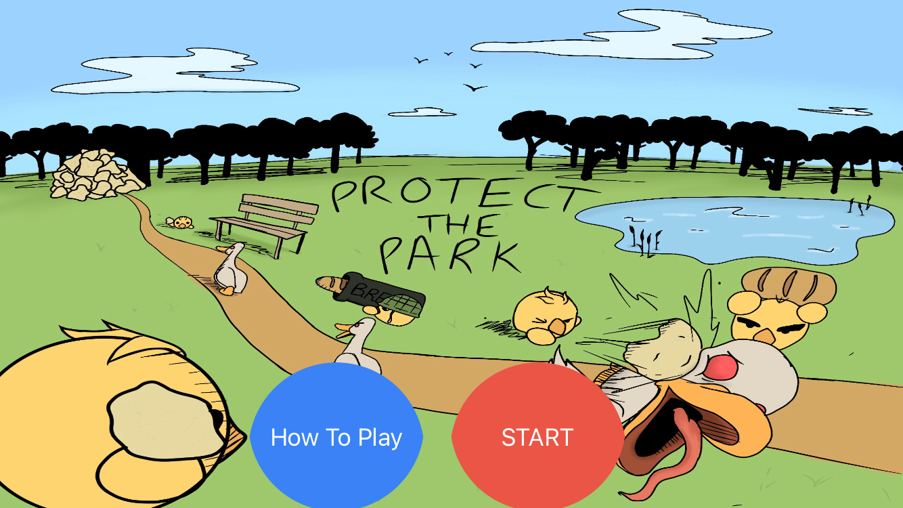

# Protect The Park 🐥 

Protect The Park is a ducky themed tower defense game where you protect your stash of bread from an incoming flock of geese! Upgrade ducks to make them stronger to be able to stop the evil geese, but watch out, the geese get stronger too!

<a href="privacy_policy.html" target="blank"> Privacy Policy</a>
: This app will not collect any information or store any information from our users.

> CURRENT VERSION: v0.5

**VERSION v0.5**
- Added Tuff goose as a miniboss
- Upon reaching level 5, basic ducks can be specialized into either Toaster or Baguette Launcher variants
- Added How to Play section to explain mechanics and buttons
- Increased total wave count to 20
- Added retry button upon winning or losing the game
- Added art to victory screen to maximize satisfaction 
- Changed portal image to dark and spooky forest 
- Updated app icon
- Made park more beautiful by planting more flowers 
- Fixed bug that caused game to freeze at unexpected times
- Fixed bug that caused extra labels to appear when upgrading a variant duck

**VERSION v0.4**
- Added demonic miniboss at the end of wave 5
- Ducks can now be upgraded with money
- WIP victory screen will appear after wave 5 is completed 
- Changes to main menu Screen

**VERSION v0.3**
- Cool Down System
- Improved Wave System

**VERSION v0.2 Build 2**
- Game over art
- WIP Goose health
- Original Icon

**VERSION v0.2**
- Updates to Sprites 
- Ducks will launch breadcrumbs at geese
- You can only place ducks on nests now
- You can purchase a duck if you have enough money
- Main menu and game over screen
- Wave system WIP
- Health System
- Currency System
- Menu Art

**Version v0.1**
